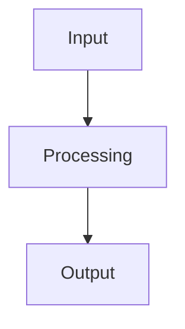

# Documentation Guide

## Overview

This directory contains comprehensive documentation for the REIMS2 NLQ/RAG system. All documentation follows Google-style docstrings and includes usage examples, API references, and troubleshooting guides.

## Documentation Structure

```
backend/docs/
├── README.md                          # This file
├── nlq_rag_system_overview.md         # System overview
├── hallucination_detector.md          # Hallucination detector guide
├── citation_extractor.md               # Citation extractor guide
├── rag_retrieval_service.md           # RAG retrieval guide
├── structured_logging_guide.md        # Logging guide
├── correlation_id_middleware.md       # Correlation ID guide
└── api_reference.md                   # Complete API reference
```

## Documentation Standards

### Docstring Format

All functions and classes use Google-style docstrings:

```python
def function_name(param1: type, param2: type) -> return_type:
    """
    Brief description (one line).
    
    Longer description with more details. Explain what the function does,
    when to use it, and any important considerations.
    
    Args:
        param1: Description of param1
        param2: Description of param2
    
    Returns:
        Description of return value
    
    Raises:
        ValueError: When invalid input provided
        ConnectionError: When external service unavailable
    
    Example:
        >>> result = function_name("value1", "value2")
        >>> print(result)
        'expected output'
    """
```

### Documentation Files

Each major component has:
1. **Overview**: What it does and why
2. **Architecture**: How it works (with diagrams)
3. **Installation**: Setup instructions
4. **Usage**: Code examples
5. **API Reference**: Complete method documentation
6. **Configuration**: All config options
7. **Error Handling**: Error scenarios and solutions
8. **Performance**: Optimization tips and targets
9. **Testing**: How to test
10. **Troubleshooting**: Common issues and solutions

## Writing Documentation

### When Adding New Components

1. **Add Docstrings**: Use Google-style format
2. **Create Guide**: Add markdown file in `docs/`
3. **Update Index**: Update `README.md` with new component
4. **Add Examples**: Include usage examples
5. **Document Errors**: List all possible errors
6. **Add Tests**: Document testing approach

### Docstring Checklist

- [ ] Brief one-line description
- [ ] Detailed description (if needed)
- [ ] All parameters documented
- [ ] Return value documented
- [ ] Exceptions documented
- [ ] Example usage (if complex)
- [ ] Type hints included

### Documentation File Checklist

- [ ] Overview section
- [ ] Architecture diagram (if complex)
- [ ] Installation instructions
- [ ] Usage examples
- [ ] Complete API reference
- [ ] Configuration options
- [ ] Error handling guide
- [ ] Performance considerations
- [ ] Testing instructions
- [ ] Troubleshooting section

## Architecture Diagrams

Use ASCII art or Mermaid for diagrams:

### ASCII Art Example

```
┌─────────────┐
│   Input     │
└──────┬──────┘
       │
       ▼
┌─────────────┐
│  Processing │
└──────┬──────┘
       │
       ▼
┌─────────────┐
│   Output    │
└─────────────┘
```

### Mermaid Example



## Code Examples

All code examples should:
- Be executable (or clearly marked as pseudocode)
- Include imports
- Show expected output
- Cover common use cases
- Include error handling

## Keeping Documentation Updated

1. **Update on Code Changes**: When code changes, update docs
2. **Review Regularly**: Review docs during code reviews
3. **Version Control**: Track doc changes in git
4. **Link to Code**: Link from docs to source code
5. **Test Examples**: Ensure all examples work

## Related Resources

- [Python Docstring Conventions](https://google.github.io/styleguide/pyguide.html#38-comments-and-docstrings)
- [Markdown Guide](https://www.markdownguide.org/)
- [Mermaid Diagrams](https://mermaid.js.org/)

